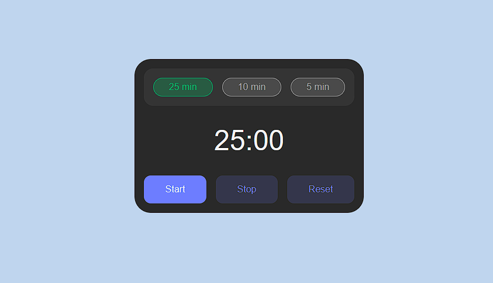

# Pomodoro Timer

A Pomodoro timer made by [Will Delorm](https://github.com/willdelorm).

## Overview

Improve your workflow with this Pomodoro timer. Work for 25 minutes, take a short break and repeat!

## Usage

Access the Pomodoro Timer here: [Pomodoro](https://willdelorm.github.io/pomodoro/)

Get comfortable, press Start and get to work!

## Contributors

Contributors are always welcome to make contributions to this project and help improve it. If you'd like to contribute or work on available issues, feel free to do so. Let's collaborate and make this calculator even better!